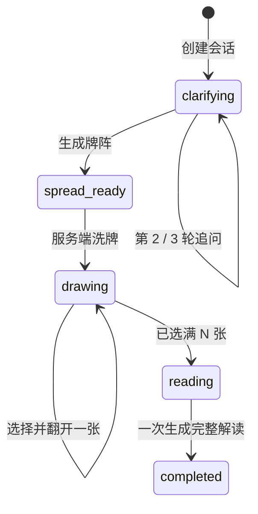

# 心镜首个纵向切片

## 本阶段完成范围

本阶段以“一个问题能够从头走到完整解读”为验收目标：

1. 用户提交一个自我觉察问题。
2. 系统进行 2–3 轮追问；问题仍模糊时进入第 3 轮。
3. Agent 根据问题直接给出 1、3 或 5 张牌阵，不让用户再跳转选择。
4. 当前页面原地展开 78 张牌，用户横向滑动并选择 N 张。
5. 每选一张立即出现翻牌动画，牌面真实名称与牌位名称分开显示。
6. 全部落位后一次生成逐张解读、整体解读与低风险行动建议。

## 状态机



服务端是会话状态的唯一事实源。客户端不能提交卡片 ID 或名称，只能提交 `slotId`；服务端从预先洗好的 78 张序列中解析真实卡片，从而避免改包、重复卡片和 AI 代选卡片。

## API

| 方法 | 路径 | 作用 |
| --- | --- | --- |
| `POST` | `/v1/sessions` | 提交问题并返回第一轮追问 |
| `POST` | `/v1/sessions/:id/clarifications` | 提交一轮回答，继续追问或返回牌阵 |
| `POST` | `/v1/sessions/:id/shuffle` | 服务端安全洗牌并返回 78 个匿名牌槽 |
| `POST` | `/v1/sessions/:id/draws` | 从某个卡槽选择真实卡片并落位 |
| `POST` | `/v1/sessions/:id/reading` | 持久化解读任务并立即返回 `202 taskId` |
| `GET` | `/v1/reading-tasks/:id` | 轮询任务，完成后一次返回逐张与全局解读 |
| `GET` | `/v1/sessions/:id` | 恢复当前会话 |
| `GET` | `/health` | 服务健康检查 |

## Effect 的职责

- 服务依赖通过 `Context.Tag` 和 `Layer` 注入。
- 会话仓库通过 `Ref` 提供原子修改；本地阶段使用内存实现。
- Agent 请求由 Effect 接管中止信号、25 秒超时和一次重试。
- 领域错误保留类型，在 Fastify 边界统一映射为 HTTP 状态码。
- 进程只创建一个 `ManagedRuntime`，Fastify 关闭时统一释放。
- 完整解读先写入 `reading_task`，再返回 `202`；Effect 执行器通过 120 秒租约原子领取任务。
- 小程序每秒轮询一次；中断后重新请求会复用同一任务，执行器重启后可在租约过期时恢复。

Effect Fiber 只负责当前进程调度，不作为可靠队列。任务事实保存在 CloudBase；重复提交不会创建第二份解读，失败任务可重新领取，已完成结果直接复用。

## Pi Agent 的边界

Pi 只开放三个终止型输出工具：

- `emit_clarification`
- `emit_spread`
- `emit_reading`

每一轮只暴露对应的一个工具，并通过 `beforeToolCall` 白名单拦截其他调用。Agent 没有文件、Shell、数据库、浏览器和网络工具。服务端另外校验追问轮次、牌阵张数以及解读中的卡牌 ID 是否与抽牌事实完全一致。

## 本地验收

```bash
pnpm install
cp .env.example .env
pnpm check
pnpm test
pnpm dev:api
pnpm dev:weapp
```

默认使用 `AI_DRIVER=fake`，可以稳定验证全流程。要验证真实 Agent：

```dotenv
AI_DRIVER=pi
PI_MODEL_ID=deepseek-chat
DEEPSEEK_API_KEY=你的服务端密钥
```

密钥只能出现在 API 服务端，不能写入 Taro 包。

## 接正式环境前仍需完成

- 将 `assets/cards/webp/` 上传到 HTTPS CDN，并设置 `CARD_ASSET_BASE_URL` 与小程序下载合法域名。
- 填入正式 AppID、CloudBase 环境/云托管服务、DeepSeek 密钥和真实公示/备案编号。
- 在 CloudBase 创建发布清单中的集合、事务所需索引与过期数据清理策略。
- 发布正式隐私政策、服务协议和反馈页面并填写 HTTPS URL。
- 在微信开发者工具和真机检查横向牌列、翻牌帧率、弱网、中断恢复及内容安全回执。
- 使用真实生产变量运行 `pnpm release:gate`，构建云托管镜像，再上传体验版提审。
